# IMDb Sentiment Analysis — From TF-IDF to Transformers

An end-to-end NLP project comparing classical TF-IDF models with fine-tuned DistilBERT, followed by error analysis of mixed sentiment and sarcasm through an interactive Streamlit application.

## Project overview

Reading one movie review is usually straightforward. Interpreting thousands automatically is harder. I started with a question: **How much does a fine-tuned Transformer actually improve over a strong classical NLP baseline?**

DistilBERT reached **90.652% test accuracy**, compared with **90.312% for LinearSVC**. The gain was modest. Trying my own reviews then revealed problems that aggregate scores did not explain: mixed opinions, ambiguous language, and confidently misread sarcasm.

## 🎬 Application Demo

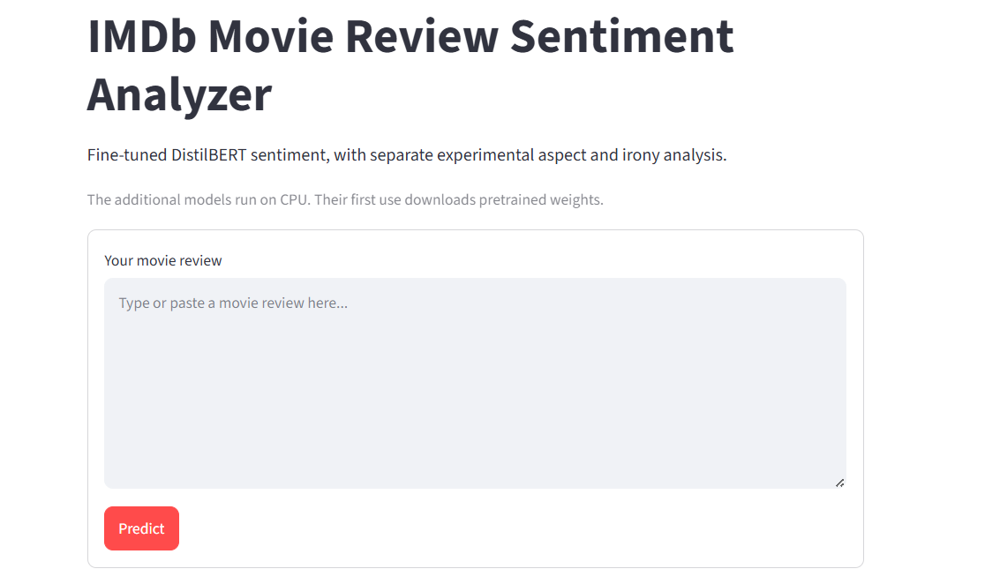

Enter your own movie review to inspect nuanced and aspect sentiment, DistilBERT's binary prediction, positive/negative probabilities, and the separate experimental irony analysis.

### Positive Review

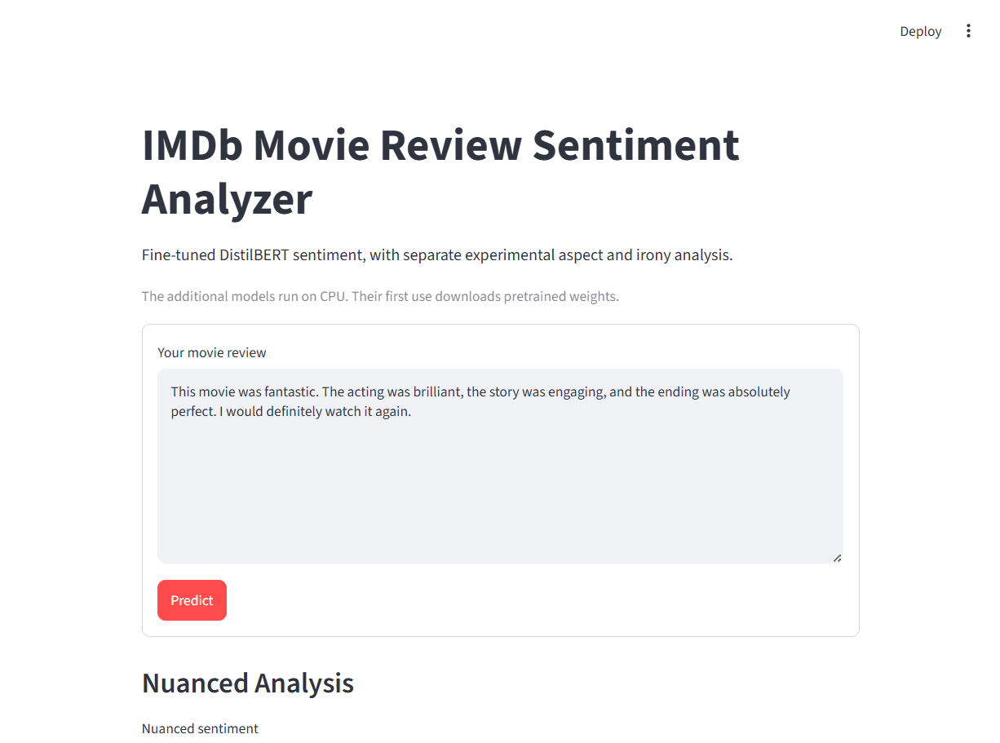

### Negative Review

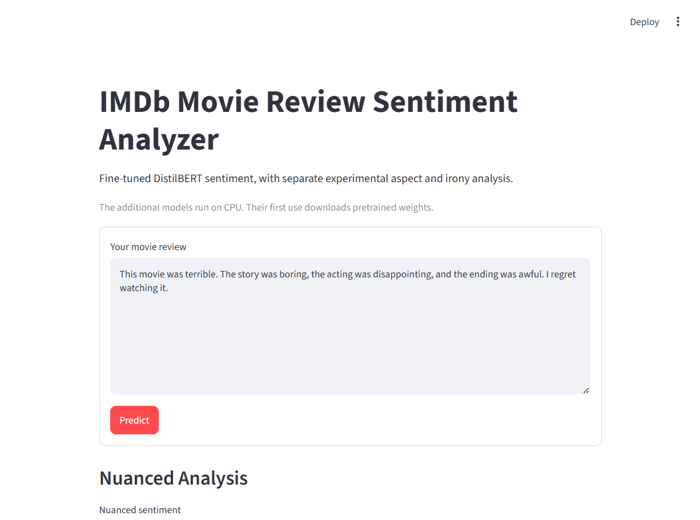

### Mixed Sentiment

Real reviews can praise one aspect and criticize another. The nuanced layer keeps those conflicting opinions visible.

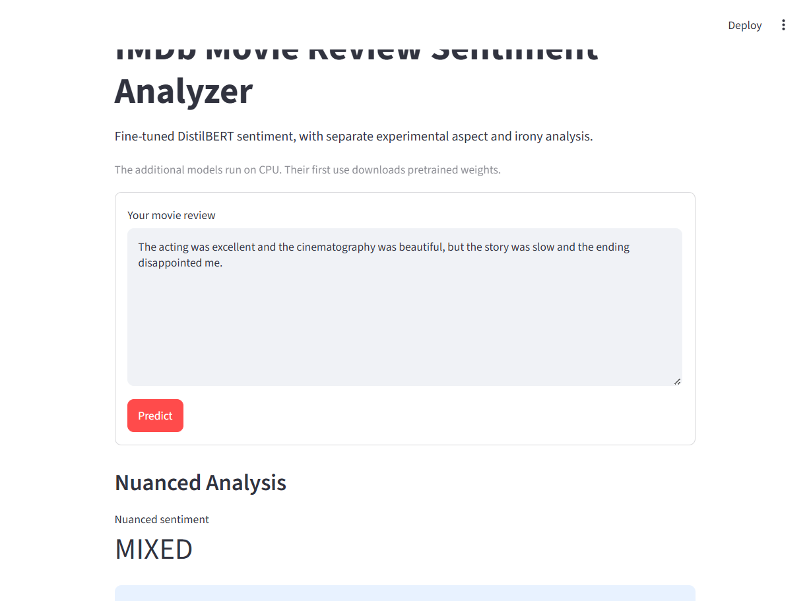

### When High Confidence Is Still Wrong — Sarcasm

> Amazing movie. I especially loved wasting two hours of my life waiting for something interesting to happen.

DistilBERT predicted **Positive with 98.29% probability**, although a human recognizes the negative sarcasm.

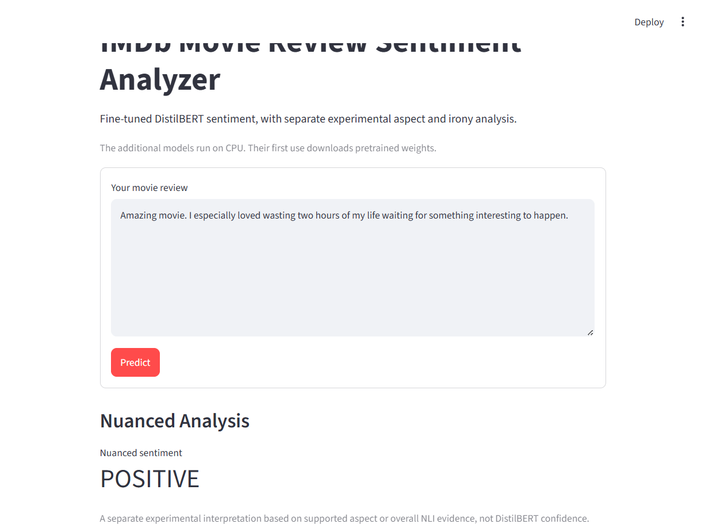

This failure motivated the separate experimental sarcasm/irony warning. The detector returned **Likely (89.13%)** in the saved checks; it never changes DistilBERT's prediction. The screenshot captures the upper result panel; full probabilities are documented in [the actual custom-review report](reports/errors/final_app_examples.json).

## Dataset and preparation

The [IMDb dataset](https://huggingface.co/datasets/stanfordnlp/imdb) contains 50,000 labeled reviews: 25,000 official training reviews and 25,000 official test reviews. The loader uses `load_dataset("imdb")`. The additional unsupervised split is not used for supervised learning.

| Split | Reviews | Negative | Positive | Purpose |
|---|---:|---:|---:|---|
| Train | 20,000 | 10,000 | 10,000 | Learn model parameters |
| Validation | 5,000 | 2,500 | 2,500 | Select models/checkpoints |
| Official test | 25,000 | 12,500 | 12,500 | Final held-out evaluation |

Validation comes only from the original training set: stratified 80/20 splitting with seed 42. Labels are **0 = Negative**, **1 = Positive**. Original review text is preserved.

EDA found no null or empty reviews. The original training set contains 96 extra exact duplicate rows; test contains 199. Official train and test share 123 distinct texts. After preparation, train/validation share 36 distinct texts, train/test 103, and validation/test 20. Row membership is disjoint, but the dataset is **not text-duplicate-free**. This limits the independence of the benchmark; the published split was preserved rather than silently changed.

See [EDA statistics](reports/metrics/eda_statistics.json) and [saved split membership](reports/metrics/split_metadata.json). Full reviews remain in the Hugging Face cache; data folders are reserved for local exports.

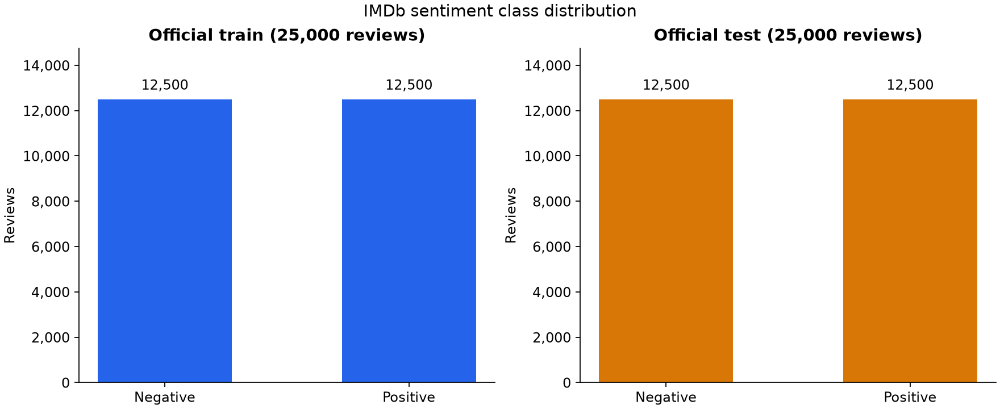
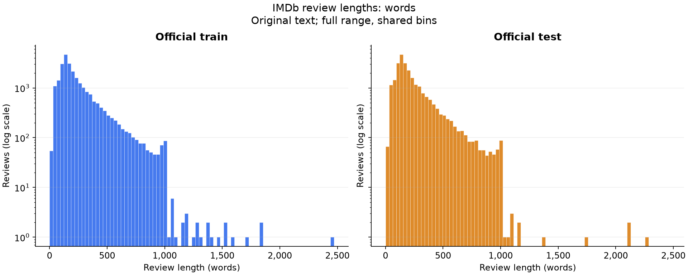

## Project pipeline

~~~mermaid
flowchart TD
    A[IMDb reviews] --> B[EDA and fixed data splits]
    B --> C[Train-only TF-IDF]
    C --> D[Logistic Regression and LinearSVC]
    B --> E[Tokenizer and DistilBERT fine-tuning]
    D --> F[Validation model selection]
    E --> G[Validation checkpoint selection]
    F --> H[Selected classical model test evaluation]
    G --> I[Selected Transformer test evaluation]
    H --> J[Comparison and error analysis]
    I --> J
    I --> K[Saved DistilBERT]
    K --> L[Streamlit app]
    M[Custom review] --> L
    L --> N[Binary sentiment and probabilities]
    L --> O[Separate experimental NLI aspect/overall analysis]
    L --> P[Separate experimental irony warning]
~~~

Secondary models do not alter the binary prediction or benchmark scores.

## Classical NLP: what I tried

### Why TF-IDF?

TF-IDF weights terms by their frequency in a review and how common they are across reviews. Compared with raw counts, it reduces the influence of terms that occur nearly everywhere. The fitted vocabulary produced **368,182 sparse features**.

The vectorizer uses lowercase text, Unicode accent normalization, unigrams and bigrams, sublinear term frequency, `min_df=2`, `max_df=0.95`, and no feature cap. Bigrams capture short phrases that individual words miss. Stopwords remain because phrases such as “not good” carry sentiment. Stemming and lemmatization are not assumed to improve sentiment classification; they can remove useful distinctions.

TF-IDF is fitted **only on training reviews**. Validation and test use the already-fitted vectorizer.

### Why LinearSVC?

Linear models work well with sparse, high-dimensional text. I compared Logistic Regression (`C=1`, liblinear, `max_iter=3000`) and LinearSVC (`C=1`, `dual="auto"`, `max_iter=10000`), both with seed 42.

| Model | Validation accuracy | Precision | Recall | F1 |
|---|---:|---:|---:|---:|
| Logistic Regression | 89.14% | 0.8848 | 0.9000 | 0.8923 |
| LinearSVC | 90.70% | 0.9062 | 0.9080 | 0.9071 |

LinearSVC won on validation F1 and accuracy. Only that classical model was evaluated on the official test set. Logistic Regression has no reported test score.

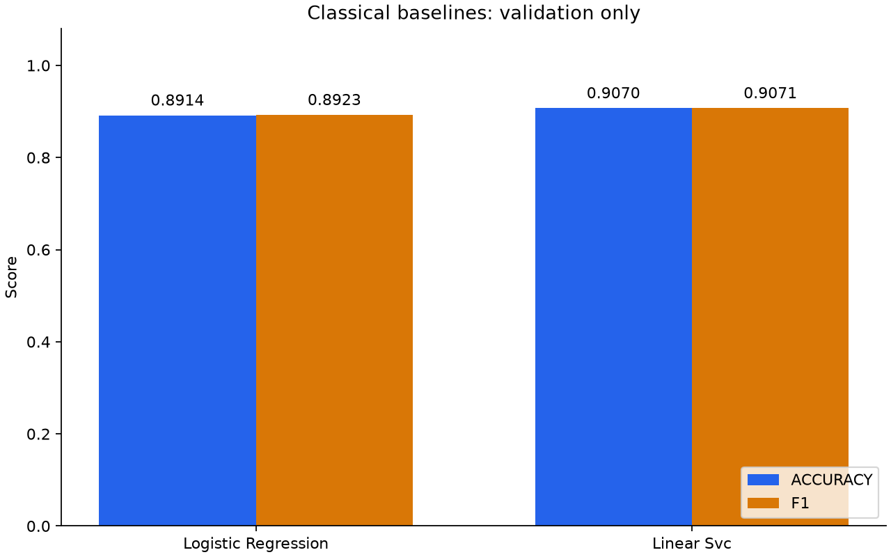

## Transformer: DistilBERT

[DistilBERT](https://huggingface.co/distilbert/distilbert-base-uncased) provides contextual representations while remaining feasible for local fine-tuning on an **NVIDIA GeForce RTX 2050 with about 4 GB VRAM**.

| Setting | Value |
|---|---|
| Base model | distilbert-base-uncased |
| Maximum sequence length | 256 tokens |
| Training / evaluation batch size | 4 / 8 |
| Gradient accumulation | 4 steps; effective batch size 16 |
| Learning rate / weight decay | 2e-5 / 0.01 |
| Maximum epochs / seed | 3 / 42 |
| Precision | FP16 on CUDA |
| Memory settings | Gradient checkpointing; dynamic padding |

The best checkpoint was **checkpoint-2500, epoch 2**, selected using validation F1 before official test evaluation.

| Epoch | Validation accuracy | Validation F1 |
|---|---:|---:|
| 1 | 89.84% | 0.897374 |
| 2 | 90.16% | 0.903944 |
| 3 | 90.24% | 0.902244 |

Epoch 3 had slightly higher accuracy but lower F1. The resumed run records 2,022.25 seconds of training time; this is not an end-to-end total including earlier interrupted work.

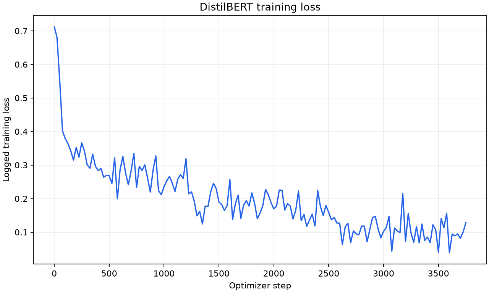
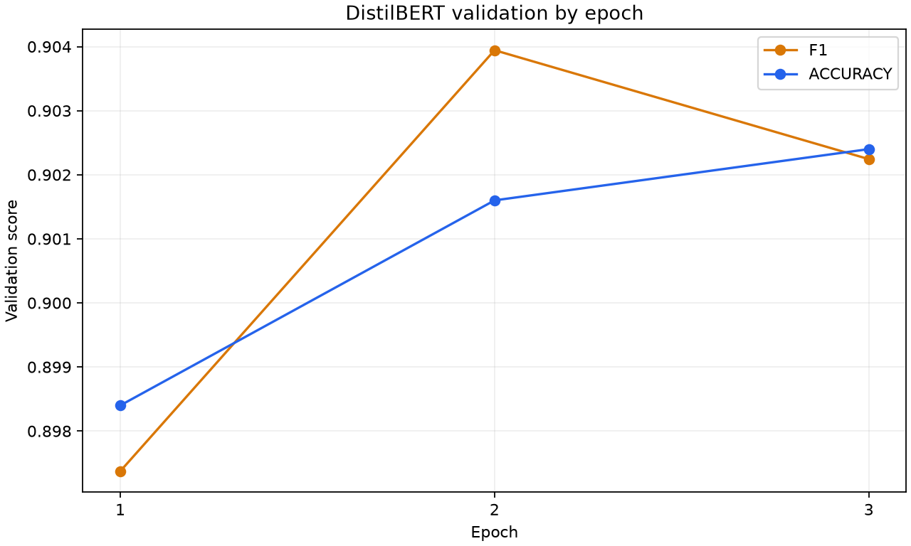

## Results so far

Precision, recall and F1 use Positive as the positive class.

| Selected model | Test accuracy | Precision | Recall | F1 |
|---|---:|---:|---:|---:|
| TF-IDF + LinearSVC | 90.312% | 0.903895 | 0.902160 | 0.903027 |
| DistilBERT | **90.652%** | 0.882730 | **0.937600** | **0.909338** |

DistilBERT improved accuracy by **0.340 percentage points**, or **85 additional correct predictions out of 25,000**. F1 improved by 0.006311. A strong classical baseline remains competitive with much less training computation. This project does not include a controlled inference-latency benchmark.

Sources: [classical results](reports/metrics/classical_results.json), [Transformer selection](reports/metrics/transformer_selection.json), [Transformer test metrics](reports/metrics/transformer_test_metrics.json).

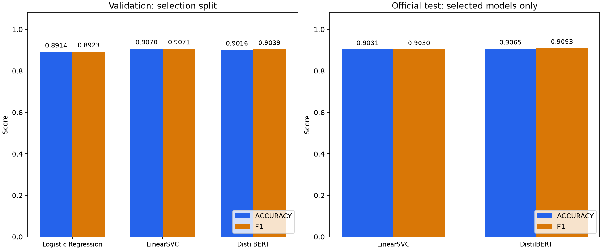

## What the model gets wrong

| Actual / predicted | Negative | Positive |
|---|---:|---:|
| Negative | 10,943 | 1,557 |
| Positive | 780 | 11,720 |

Positive recall is high (0.937600), but precision is lower (0.882730). DistilBERT catches more positive reviews while labeling more negative reviews as positive. Compared with LinearSVC, false negatives fell from 1,223 to 780, while false positives rose from 1,199 to 1,557.

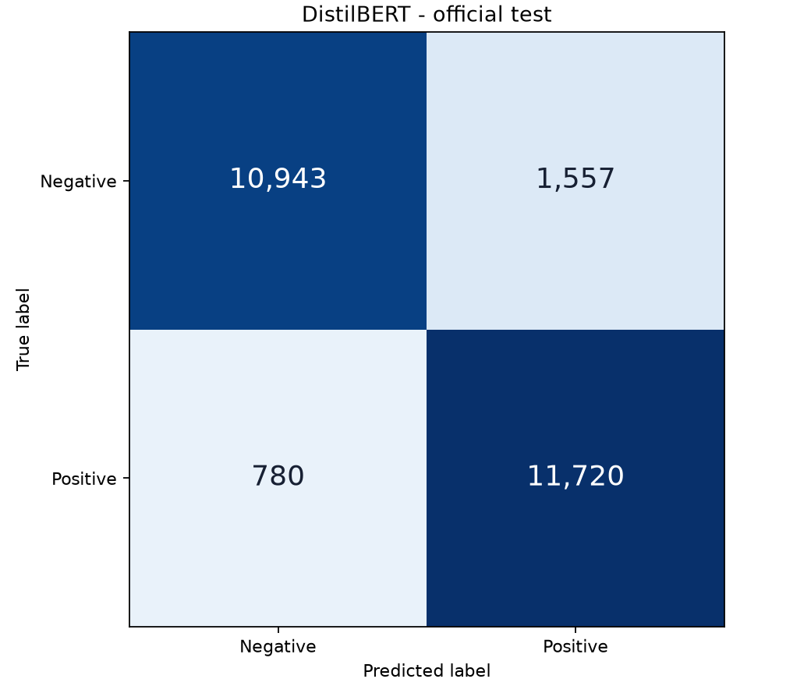

Evaluation scripts export correctly classified positives/negatives and false positives/negatives with text and scores under `reports/errors/`. These local review exports are excluded from Git. The examples below are separate usability checks, not another benchmark.

## Real reviews I tested

Actual final outputs and supporting evidence are saved in [the custom-review report](reports/errors/final_app_examples.json).

> The acting was excellent and the cinematography was beautiful, but the story was slow and the ending disappointed me.

Nuanced result: **Mixed**. Supported aspects: **Acting → Positive**, **Cinematography → Positive**, **Ending → Negative**. Story did not pass the evidence gate. DistilBERT independently predicted **Negative (96.45%)**.

> it was ok ok i m confused what i felt

Nuanced result: **Uncertain / Insufficient evidence**. No supported aspects or sufficiently strong overall evidence were found. DistilBERT predicted **Negative (95.79%)**; that confidence does not resolve the ambiguity for the nuanced layer.

> Amazing movie. I especially loved wasting two hours of my life waiting for something interesting to happen.

DistilBERT predicted **Positive (98.29%)**. The experimental irony detector returned **Likely (89.13%)**. The overall NLI fallback also returned Positive. A human reads this as sarcastically negative, but the sentiment models were confidently wrong. This failure motivated the separate warning; the app never flips the binary result automatically.

> worst

DistilBERT predicted **Negative (96.52%)**, but the nuanced result remained **Uncertain / Insufficient evidence**. The separate NLI model's negative entailment score was 0.39054, below the 0.70 threshold. The general fallback can accept strong overall evidence without a named aspect, but does not force this short input into a category.

## Mixed and aspect sentiment — experimental

Binary sentiment cannot express “good acting, disappointing ending.” A separate [NLI MiniLM model](https://huggingface.co/cross-encoder/nli-MiniLM2-L6-H768) checks explicit aspect mentions and polarity hypotheses. Supported conflicting evidence produces Mixed.

Without supported aspect polarity, the NLI model checks overall positive, negative and uncertainty hypotheses. Overall polarity requires at least 0.70 entailment support and a 0.20 margin over both opposing polarity and uncertainty. Otherwise it returns Uncertain / Insufficient evidence. These exploratory thresholds are not calibrated probabilities of correctness.

Aspect evidence takes priority. DistilBERT confidence never decides the nuanced label. Noun anchors help avoid invented aspects, but implicit aspects can be missed. Processing is limited to 24 clauses and 256 tokens per NLI pair. This extension is **not part of the official IMDb benchmark**.

## Sarcasm / irony — experimental

The separate [CardiffNLP Twitter RoBERTa irony model](https://huggingface.co/cardiffnlp/twitter-roberta-base-irony) was trained for TweetEval irony detection, not movie-review sentiment. Its real softmax output provides Likely/Unlikely and an irony probability.

A Likely flag displays: **“Possible sarcasm/irony detected. The binary sentiment prediction may be unreliable.”** The detector never flips DistilBERT's label. It can miss sarcasm or flag ordinary language; sarcasm is not solved here.

## Streamlit application

Enter a review to see nuanced sentiment, supported aspects, the unchanged DistilBERT prediction and both probabilities, the irony check, and verified model performance.

**Softmax probabilities represent model confidence and are not calibrated certainty.**

Models are resource-cached. DistilBERT uses CUDA when available, otherwise CPU. The secondary models run on CPU. Empty input is rejected; secondary-model failures leave the binary result available.

The real application screenshots above show the local Streamlit interface.

## Tech stack

Python, Hugging Face Datasets and Transformers, PyTorch, CUDA, scikit-learn, NumPy, Matplotlib, Joblib, and Streamlit.

## Project structure

~~~text
imdb-sentiment-analysis/
├── app/streamlit_app.py        # Interactive inference UI
├── src/imdb_sentiment/
│   ├── data/                  # Loading and fixed splitting
│   ├── analysis/              # EDA
│   ├── features/              # TF-IDF
│   ├── models/                # Classical and DistilBERT code
│   ├── evaluation/            # Metrics, plots, error exports
│   ├── inference.py           # Saved DistilBERT inference
│   └── nuanced_analysis.py    # Experimental NLI and irony
├── scripts/                   # Preparation and experiment entry points
├── tests/                     # Split, feature, Transformer, policy checks
├── configs/                   # Initial configuration scaffold
├── reports/
│   ├── metrics/               # Results and saved split membership
│   ├── figures/               # Actual experiment plots
│   └── errors/                # Error exports and final custom checks
├── artifacts/                 # Local trained models; ignored
├── data/                      # Reserved local export folders
├── notebooks/                 # Exploration notes
├── docs/images/               # Real Streamlit screenshots
├── requirements.txt
└── README.md
~~~

Runnable scripts and the saved training configuration define the completed experiments. `configs/default.yaml` remains an initial scaffold.

## How to run — Windows / PowerShell

From the project directory, use Python 3.13 to match the verified environment:

~~~powershell
py -3.13 -m venv .venv
.\.venv\Scripts\python.exe -m pip install -r requirements.txt
.\.venv\Scripts\python.exe -m pip check
~~~

Requirements pin the working CUDA 12.8 PyTorch wheel (`torch==2.11.0+cu128`). This is the verified Windows/NVIDIA environment, not a cross-platform lock. CPU inference is supported by the code when CUDA is unavailable.

### Restore the trained model first

The app expects the **fine-tuned project model** under `artifacts/transformer/best_model/`. Git excludes weights and checkpoints. A source-only clone cannot predict until that export is restored.

Copy the existing export from your backup or obtain it from the project author. No published download URL is configured. Keep these files together: `config.json`, `model.safetensors`, `tokenizer.json`, `tokenizer_config.json`, `special_tokens_map.json`, and `vocab.txt`. The base model is not a substitute. See [model artifact instructions](docs/model_artifacts.md).

Experimental models download from Hugging Face on first use into `.cache/huggingface/hub/`. Internet access and disk space are needed initially. DistilBERT loads only the local saved model. The IMDb dataset is not required to use the app.

~~~powershell
.\.venv\Scripts\python.exe -m streamlit run app\streamlit_app.py
~~~

Development checks, without rerunning official evaluation:

~~~powershell
.\.venv\Scripts\python.exe -m unittest discover -s tests -v
~~~

Experiment entry points are `scripts/prepare_data.py`, `scripts/run_eda.py`, `scripts/train_classical.py` and `scripts/train_transformer.py`. Training is not part of app startup. Existing reports should not be overwritten just to launch the app.

## Limitations

- One fixed split and seed; no statistical-significance claim for the small gain.
- Exact duplicate texts overlap across splits despite disjoint row membership.
- DistilBERT truncates at 256 tokens, potentially omitting later changes of opinion.
- Softmax confidence can be high on incorrect or out-of-domain inputs.
- Implicit aspects, short inputs, mixed opinions and sarcasm remain difficult.
- Secondary models have no IMDb aspect/sarcasm benchmark evaluation.
- The tweet-trained irony model is not calibrated for movie reviews.
- Trained weights must be restored separately after cloning.

## What I learned

I learned to take a strong classical baseline seriously: the Transformer improved the result, but only slightly. Validation and test separation made model selection easier to defend. The confusion matrix explained a tradeoff that accuracy alone hid. Testing my own sentences showed how little a confident prediction can guarantee.
